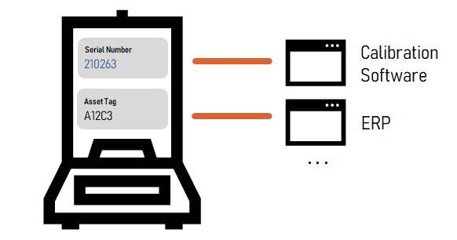
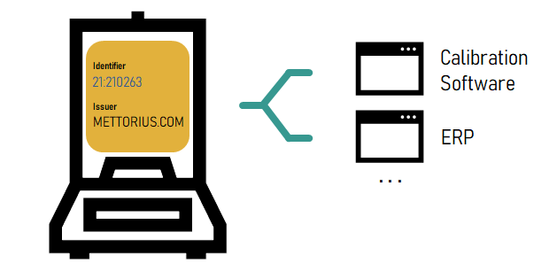
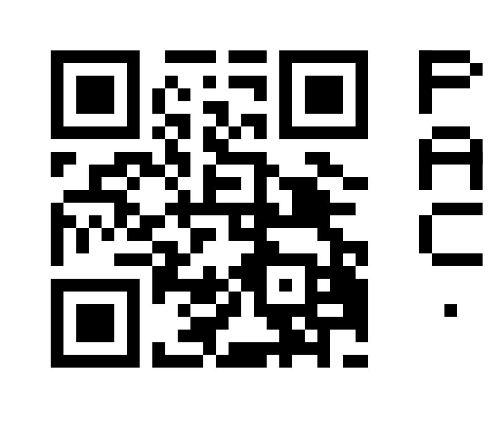
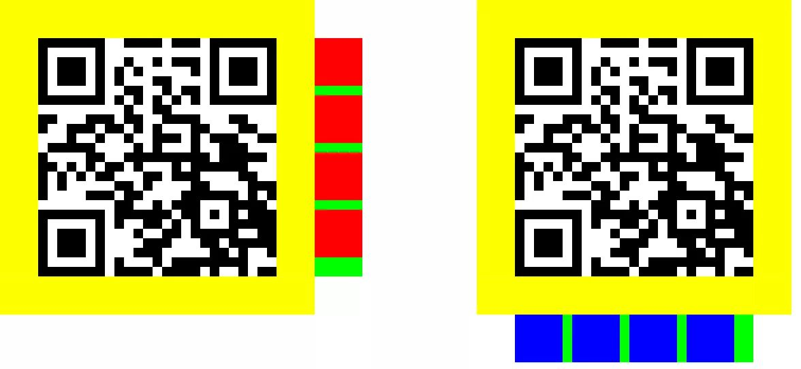
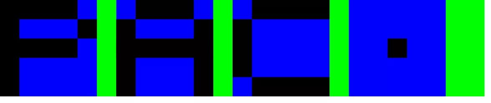

# PAC-ID

## Introduction

Laboratory software needs to unambiguously refer to real world objects and data. Typically, this is achieved by assigning unique identifiers to objects and data sets. As of today, each software product creates its own proprietary identifiers. With an increasing number of software products deployed in labs, objects usually end up having multiple identifiers. This impacts usability, causes errors and increases maintenance efforts.

The Balance is known under **multiple** identifiers as each system issues its own.

As part of the Smart Building Blocks for Digital Labs initiative, the **publicly addressable content identifier ("PAC-ID")** addresses this by promoting the re-use of already existing identifiers. The identifier is augmented with information about the issuing system and is represented in standardized formats, thus making it globally unique and reusable across system borders.

All systems are using the the **same** globally unique identifier for referring to the balance.

The `PAC-ID` also serves as foundation for further Smart Building Blocks that provide functionality that wouldn’t be feasible with proprietary identifiers.

## Specification

### Components

A PAC-ID is composed of an `issuer` and `identifier`. It is REQUIRED that the combination of `issuer` and `identifier` is globally unique.

| **Name** | **Meaning** | **Technical Requirements** | **Example** |
| :--- | :--- | :--- | :--- |
| `issuer` | The party which issued the identifier and knows what the identifier refers to. | MUST be a valid domain name according to [RFC 1035](https://www.ietf.org/rfc/rfc1035.html). SHOULD be a registered and active domain name. SHOULD contain only the following characters `A-Z`, `0-9`, `-`, and `.` | "METTORIUS.COM" (The manufacturer of the balance) |
| `identifier` | The identifier itself. | MUST consist of one or more `id segments` separated by `/`. At least one `id segment` MUST be non-empty. MUST not exceed 256 characters. | "DEVICE/21:210263" (An identifier for one particular balance) |
| `id segment` | The `id segment` is a part of an `identifier` that can stand on its own. Typically used to organize `identifier`s within an `issuer`. | MUST be a valid `hsegment` according to [RFC 1738](https://www.ietf.org/rfc/rfc1738.txt), but without `*`. SHOULD be limited to `A-Z`, `0-9`, and `:-+` for new designs. CAN be an `id segment key` and `id segment value` pair separated by `:` | "21:210263" (A id segment containing a serial number) |
| `id segment key` | The `id segment key` describes the meaning of the `id segment value`. | CAN be a [GS1 application identifier](https://www.gs1.org/standards/barcodes/application-identifiers) SHOULD be limited to `A-Z`, `0-9`, and `-+` | 21 (GS1 identifier for Serial Number) |
| `id segment value` | The value corresponding to the `id segment key` | SHOULD be limited to `A-Z`, `0-9`, and `-+` | 210263 (A Serial Number) |

### Serialization

#### URL Format

| **URI Component\*** | **Value** |
| :--- | :--- |
| `scheme` | Always `"HTTPS"`. |
| `host` | The `issuer` of the `PAC-ID`, prefixed by `"PAC."`. |
| `path` | The `identifier` of the `PAC-ID`, potentially followed by `*` and arbitrary content. `*` and subsequent characters are not part of the `PAC-ID` and MUST be ignored (extension space). |

\* according to [RFC 3986](https://www.rfc-editor.org/rfc/rfc3986#appendix-A)

All other URI components MUST be empty.

### Transmission

PAC-ID’s MAY be transmitted by any means adequate for the corresponding serialization format (e.g. QR-Code, NDEF, iBeacon, etc for URL).

#### Visual Markers

If a PAC-ID is represented as QR code or data matrix code, a visual marker MUST be added.

##### Placement of the visual marker

-   MUST be placed to the left or to the bottom of the code
-   The spacing between visual marker and barcode MUST match its minimum quiet zone (e.g. 4 modules for QR, 1 module for Data Matrix)
-   Visual Markers placed at the bottom SHALL start from left to right. Right to Left is allowed when surrounded by RTL languages.
-   Visual Markers placed at the left, SHALL start from top to bottom

##### Visual marker design

- Each Visual Marker SHALL consists of 5x5 module size visual marker squares
- There MUST be 1 module space between the visual marker squares
- Each visual marker square MUST have at least one of its 25 modules set

## Recommendations

### Identifier Encodings

If designing new systems, consider using Base36 encoded identifiers for maximizing efficiency when embedded in a QR Code or DataMatrix.

For legacy systems it is recommended to use identifiers as is (with URL-encoding for characters that don’t comply with the character space valid for `id segments`.

### Design Considerations for ID Segments

Using multiple `id segment`s might seem unnecessary overhead at first. Adding a few additional `id segments`, however considerably increases the usefulness of `PAC-ID`s in conjunction with other Smart Building Blocks, especially the `PAC-ID Resolver` (The `PAC-ID Resolver` is able to provide user-handovers/routing to systems that provide information about the corresponding ID. See [PAC-ID Resolver on GitHub](https://github.com/ApiniLabs/pac-id-resolver) for more info.

-   Add additional `id segment`s containing information that allows lookup in pre-existing systems (e.g. for a device, its serial number might be the only necessary `id segment` needed for a uniqueness perspective. However, adding the article/product/model number in addition likely allows routing to considerably more content that is relevant for this device)

-   Add `id segment`s that partition by resource type or domain. (e.g. a CDS can only provide more information about Chromatography runs, but not MS runs)

-   Using key/value syntax with standardized keys enables `PAC-ID` routing in generic contexts.

## Terminology Used

The key words "MUST", "MUST NOT", "REQUIRED", "SHALL", "SHALL NOT", "SHOULD", "SHOULD NOT", "RECOMMENDED", "MAY", and "OPTIONAL" in this document are to be interpreted as described in [RFC 2119](https://www.ietf.org/rfc/rfc2119.txt) "Key words for use in RFCs to Indicate Requirement Levels".

## FAQ

## License

Shield: [![CC BY-SA 4.0][cc-by-sa-shield]][cc-by-sa]

This work is licensed under a
[Creative Commons Attribution-ShareAlike 4.0 International License][cc-by-sa].

[![CC BY-SA 4.0][cc-by-sa-image]][cc-by-sa]

[cc-by-sa]: http://creativecommons.org/licenses/by-sa/4.0/
[cc-by-sa-image]: https://licensebuttons.net/l/by-sa/4.0/88x31.png
[cc-by-sa-shield]: https://img.shields.io/badge/License-CC%20BY--SA%204.0-lightgrey.svg

## Introduction

Laboratory software often needs to unambiguously refer to real world objects and data. Typically, this is achieved by assigning unique identifiers to objects and data sets. Unfortunately, as of today, each software product creates its own proprietary identifiers. This causes two main issues:

- It is not possible to determine the system which issued the identifier.

- The same items can have multiple identifiers. This is not a problem by default, however, as soon as one starts labelling items with identifiers, too many labels are either impossible to place or lead to usability issues.

Hence, to address this, we propose an easy to implement, standardized **publicly addressable content identifier (“PAC-ID”)**.

Examples of what can be referenced using PAC-ID's across systems:

- substances, such as stock chemicals, reagents, standards or intermediates.

- instrument parameter or result sets, such as HPLC methods and results.

- assets, such as lab devices.

- complete reports, such as analysis certificates or batch records, even among different companies, for example a service lab with its clients.

## Example PAC-ID

A PAC-ID can be represented in different ways, for example as a QR code. Such codes include an easy-to-recognize visual element on the side of the code:

PAC-IDs can also be represented in textual form:

https: // pac. `apinilabs.com` / `myapp` ?i= `MDEyMzQ1Njc4OTAxMjM0NQ`

The **issuer** (in this example `apinilabs.com`), **category** (`myapp`) and **identifier** (`MDEyMzQ1Njc4OTAxMjM0NQ`), which are explained further down, are highlighted.

## Specification

A `PAC-ID` SHALL be composed of three parts. It is REQUIRED that the combination of the three parts is globally unique.

| **Part** | **Name** | **Meaning** | **Examples** |
| :--- | :--- | :--- | :--- |
| 1 | `issuer` | The party which issued the identifier and knows what the identifier refers to. This string MUST be a valid domain name according to [RFC 1035](https://www.ietf.org/rfc/rfc1035.html) and SHOULD be a registered and active domain name. | "apinilabs.com", "metorius.com" |
| 2 | `category` | The category, e.g. application, service or product the identifier is related to or the type of identifier, etc. This string MUST be a valid `path` component according to [RFC 3986](https://www.ietf.org/rfc/rfc3986.html) and MUST not exceed 256 characters; i.e. it MAY also be an empty string. | "lims", "eln", "inventory", "sn", "cds" |
| 3 | `identifier` | The identifier itself. This string MUST be a valid `query` component according to [RFC 3986](https://www.ietf.org/rfc/rfc3986.html) and MUST not exceed 256 characters. | "123", "s-45". "454c2493-202f-4efd-b7a6-d0750f764596" |

## Textual Representation

A `PAC-ID` shall be represented as a text in the form of a `URI` (according to [RFC 3986](https://www.ietf.org/rfc/rfc3986.html)) as follows. It is recommended that the `PAC-ID` is a `URL` that locates a human readable web page which at least discloses information about the `issuer`.

| **URI Component\*** | **Value** |
| :--- | :--- |
| `scheme` | Always `"https"`. |
| `host` | The `issuer` of the `PAC-ID`, prefixed by `"pac."`. |
| `path` | The `category` of the `PAC-ID`. The path component MUST be percent-encoded (“URL encoded”) when producing the URI. |
| `query` | The `identifier` of the `PAC-ID`, prefixed by `"i="`. The identifier MUST be percent-encoded (“URL encoded”) when producing the URI. |

\* according to [RFC 3986](https://www.rfc-editor.org/rfc/rfc3986#appendix-A)

All other URI components MUST be empty.

### Example

A PAC-ID with the `issuer` "apinilabs.com", the `category` "lims-a" and the `identifier` "71728882-8c0d-4939-9947-31877854519c". As recommended, the identifier is a 128-bit UUID (according to [RFC 4122](https://www.ietf.org/rfc/rfc4122.html)). In order to save space in the textual representation, the UUID is base64url encoded (according to [RFC 4648](https://www.ietf.org/rfc/rfc4648.html)).

The resulting PAC-ID in textual representation is: `https://pac.apinilabs.com/lims-a?i=cXKIgowNSTmZRzGHeFRRnA==`

## Other Representations

A `PAC-ID` MAY also be represented by using other means that are capable of encoding URIs, such as (non-exhaustive list):

- Any type of [matrix barcode](https://en.wikipedia.org/wiki/Barcode#Matrix_(2D)_barcodes) (or two-dimensional barcodes), such as [QR codes](https://en.wikipedia.org/wiki/QR_code) or [Data Matrix](https://en.wikipedia.org/wiki/Data_Matrix).

- Any type of near field communication ([NFC](https://en.wikipedia.org/wiki/Near-field_communication)), e.g. using the NFC Data Exchange Format (NDEF).

### Visual Markers

If a PAC-ID is represented as QR code or data matrix code, a visual marker must be added as follows:

- QR code: on any of the sides, 4 modules space, add 5x5 module size squares, 1 module space, minimum 1 module (then in the center) or max 25 modules (quiet zone = 4 modules)

- Data matrix code: same as above, but 1 symbol space (quiet zone = 1 symbol)

If a PAC-ID is represented by NFC, then next to the “NFC” Logo, add a visual like for the QR, but pixel size must correspond to a 72dpi raster.

### Example

The PAC-ID `https://pac.apinilabs.com/myapp?i=MDEyMzQ1Njc4OTAxMjM0NQ` from the example above, represented as a QR code with appropriate visual markers:

## Terminology Used

The key words "MUST", "MUST NOT", "REQUIRED", "SHALL", "SHALL NOT", "SHOULD", "SHOULD NOT", "RECOMMENDED", "MAY", and "OPTIONAL" in this document are to be interpreted as described in [RFC 2119](https://www.ietf.org/rfc/rfc2119.txt) "Key words for use in RFCs to Indicate Requirement Levels".

## FAQ
**Q: Why is a PAC-ID represented as an https URL?**

**A:** The biggest advantage is that PAC-IDs can directly be entered as address into a browser (or scanned via QR code for example) on almost any device. To be able to easily recognize a PAC-ID as such, it was decided to use the subdomain `pac.` instead.

**Q: Why is the identifier of a PAC-ID located in the query string?**

**A:** Query strings are easily accessible on the server side. In the textual representation, the query string is clearly separated from the rest, left of the question mark ("?").

**Q: Why is the subdomain "pac." used?**

**A:** First of all, it's easy recognizable as a PAC-ID with this prefix/subdomain. Also, the `issuer` of a PAC-ID usually corresponds to the same domain name as the product manufacturer who distributed a PAC-ID. As most manufacturers are running a "www" web site on their main domain, usually under control of the marketing department, it is much easier to release a PAC-ID resolver on a subdomain than on a specific path like "/pac-id". See also question above on "Why is a PAC-ID represented as an https URL?".

**Q: Why not using the ["tag:" scheme](https://en.wikipedia.org/wiki/Tag_URI_scheme)?**

**A:** The `tag:` URI scheme would not allow to form valid URLs. This was considered a major disadvantage, see also question above on "Why is a PAC-ID represented as an https URL?".

**Q: Is the usage of PAC-IDs limited to life science / laboratories?**

**A:** Not by design. In principle PAC-IDs could be used everywhere where real world objects need to be unambiguously identified and referred to among otherwise unrelated systems.

**Q: Is there any recommendation for the identifier?**

**A:** Basically the `identifier` is almost free to use with any format you'd like. Also, you can just reuse your existing identifiers. Other than that it's recommended to use a 128-bit UUID as identifier (encoded as base64url according to [RFC 4648](https://www.ietf.org/rfc/rfc4648.html)).

**Q: How do I translate an ID into a PAC-ID when I am not the issuer of the ID?**

**A:** Every ID can be translated into a valid PAC-ID using the specification above, if the `issuer` and `category` are known.

**Q: Can I rely on this PAC-ID specification staying stable?**

**A:** This specification is intentionally kept very simple to minimize the risk for future breaking changes. It is planned to publish this specification under the umbrella and leadership of a neutral body.

**Q: Are there any royalties for using a PAC-ID / implementing this specification?**

**A:** No, PAC-IDs may be freely used. The specification itself is licenced as "Creative Commons Attribution Share Alike 4.0".

**Q: The PAC-ID's textual representation is not an URL where I want users to get up to, how do I direct the user to the right place / my real website?**

**A:** According to the specification, it is recommended that the textual representation of the PAC-ID is a browsable URL. You are free to create appropriate "forwards" to direct browsers to the correct site.

**Q: What shall I do if the QR code representation of a PAC-ID gets too big to attach to the target item?**

**A:** You may use another representation than QR codes, such as data matrix codes or NFC tags. Another option is to use shorter `issuer`, `category` or `identifiers`.

**Q: Why not having a visual element inside the QR code?**

**A:** Putting an icon or any other visual element in the center of a QR code the free storage space for content will be decreased. Since we want the QR codes as small as possible wo placed the visual element next to the QR code. Also, rendering QR codes with an icon inside to a small display or label with low resolution is not that easy.

**Q: I have a better idea, how can I contribute?**

**A:** Create a new issue suggesting your contribution here: [PAC-ID Issues](https://github.com/ApiniLabs/PAC-ID/issues). Search if such an issue already exists. If you like, make changes, commit them and create a pull request for your changes to be reviewed and eventually merged.

**Q: How do I embed version numbers?**

**A:** Version numbers are not specified in order to keep PAC-IDs simple. If the identifiers are versioned, it is recommended to append a postfix to the identifier, with '~' as separating character, like in this example: `MDEyMzQ1Njc4OTAxMjM0NQ~v2`.

**Q: How do I identify a well or multiple wells of a microtiter plate (MTP) (which has a PAC-ID itself) by a PAC-ID?**

**A:** MTP well identifiers are not specified in order to keep PAC-IDs simple. If you like to identify wells by coordinates, it is recommended to append it to the identifier with "." as separator like in this example: `MDEyMzQ1Njc4OTAxMjM0NQ.H7`. Unfortunately, there is no standardized naming of wells, however the following scheme is widely used: 96-well plate coordinates range from `A1` to `H12`, 384-well plates coordinates range from `A1` to `P24`, 1536-well plates coordinates range from `A1` to `AF48`, ... Multiple wells (`E8;A5`) and well ranges (`A1:H1`) or combinations (`E8:H8;A9:D9`) can be addressed using "Excel" cell addressing style. Do not forget to URL encode the query string, like in this example for addressing well range `E8:H8;A9:D9`: `https://pac.apinilabs.com/myapp?i=MDEyMzQ1Njc4OTAxMjM0NQ.E8%3AH8%3BA9%3AD9`

**Q: I like that a PAC-ID points to my own (proprietary or local) service instances, e.g. to access my own ELN, LIMS, inventory system, ...**

**A:** This is provided as a separate Smart Building Block named [PAC-Resolver](https://github.com/ApiniLabs/PAC-ID-Resolver).

## License

Shield: [![CC BY-SA 4.0][cc-by-sa-shield]][cc-by-sa]

This work is licensed under a
[Creative Commons Attribution-ShareAlike 4.0 International License][cc-by-sa].

[![CC BY-SA 4.0][cc-by-sa-image]][cc-by-sa]

[cc-by-sa]: http://creativecommons.org/licenses/by-sa/4.0/
[cc-by-sa-image]: https://licensebuttons.net/l/by-sa/4.0/88x31.png
[cc-by-sa-shield]: https://img.shields.io/badge/License-CC%20BY--SA%204.0-lightgrey.svg
