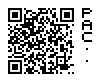

# PAC-ID (Draft)

## Introduction

Laboratory software often needs to unambiguously refer to real world objects and data. Typically, this is achieved by assigning unique identifiers to objects and data sets. Unfortunately, as of today, each software product has its own proprietary identifiers. This causes two main issues:

- It is not possible to determine the system who issued the identifier.

- The same items can have multiple identifiers. This is not a problem by default, however, as soon as one starts labelling items with identifiers, too many labels are either impossible to place or lead to usability issues.

Hence, to address this, we propose an easy to implement, standardized **publicly addressable content identifier (“PAC-ID”)**.

Examples of what can be referenced using PAC-ID's accross systems:

- substances, such as stock chemicals, reagents, standards or intermediates.

- instrument parameter or result sets, such as HPLC methods and results.

- assets, such as lab devices.

- complete reports, such as analysis certificates or batch records, even among different companies, for example a service lab with its clients.

## Example PAC-ID

A PAC-ID can be represented in different ways, for example as a QR code. Such codes include an easy-to-recognize visual element on the side of the code:

PAC-IDs can also be represented in textual form:

https: // pac. `apinilabs.com` / `myapp` ?i= `MDEyMzQ1Njc4OTAxMjM0NQ`

The **issuer** (in this example `apinilabs.com`), **category** (`myapp`) and **identifier** (`MDEyMzQ1Njc4OTAxMjM0NQ`), that are explained further down, are highlighted.

## Specification

A `PAC-ID` SHALL be composed of three parts. It is REQUIRED that the combination of the three parts is globally unique.

| **Part** | **Name** | **Meaning** |
| :--- | :--- | :--- |
| 1 | `issuer` | The party who issued the identifier and knows what the identifier refers to. This string MUST be a valid domain name and SHOULD be a registered and active domain name. |
| 2 | `category` | The category, e.g. application, service or product the identifier is related to or the type of identifier, etc. This string MUST be a valid `path` component according to [RFC 3986](https://www.ietf.org/rfc/rfc3986.html); i.e. it MAY also be an empty string. |
| 3 | `identifier` | The identifier itself. This string MUST be a valid `query` component according to [RFC 3986](https://www.ietf.org/rfc/rfc3986.html). It is RECOMMENDED to use a 128bit UUID as identifier (encoded as base64url according to [RFC 4648](https://www.ietf.org/rfc/rfc4648.html)). |

## Textual Representation

A `PAC-ID` shall be represented as a text in the form of an `URI` (according to [RFC 3986](https://www.ietf.org/rfc/rfc3986.html)) as follows. It is recommended that the `PAC-ID` is a `URL` that locates a human readable web page which at least discloses information about the `issuer`.

| **URI Component\*** | **Value** |
| :--- | :--- |
| `scheme` | Always `"https"`. |
| `host` | The `issuer` of the `PAC-ID`, prefixed by `"pac."`. |
| `path` | The `category` of the `PAC-ID`. The path component MUST be percent-encoded (“URL encoded”) when producing the URI. |
| `query` | The `identifier` of the `PAC-ID`, prefixed by `"i="`. The identifier MUST be percent-encoded (“URL encoded”) when producing the URI. |

\* according to [RFC 3986: Uniform Resource Identifier (URI): Generic Syntax (rfc-editor.org)](https://www.rfc-editor.org/rfc/rfc3986#appendix-A)

All other URI components MUST be empty.

### Example

Let us craete a string representation of a PAC-ID with `issuer`="apinilabs.com", `category`="myapp" and `identifier`="30313233-3435-3637-3839-303132333435". As recommended, the identifier is a 128bit UUID. In order to save space in the textual representation, the UUID is base64url encoded.

The resulting PAC-ID in textual representation is: `https://pac.apinilabs.com/myapp?i=MDEyMzQ1Njc4OTAxMjM0NQ`

## Other Representations

A `PAC-ID` can also be represented by using other means that are capable of encoding URIs, such as (non-exhaustive list):

- Any type of [matrix barcode](https://en.wikipedia.org/wiki/Barcode#Matrix_(2D)_barcodes) (or two-dimensional barcodes), such as [QR codes](https://en.wikipedia.org/wiki/QR_code) or [Data Matrix](https://en.wikipedia.org/wiki/Data_Matrix).

- Any type of near field communication ([NFC](https://en.wikipedia.org/wiki/Near-field_communication)), e.g. using the NFC Data Exchange Format (NDEF).

### Visual Markers

If a PAC-ID is represented as QR code or data matrix code, a visual must be added as follows:

- QR code: on any of the sides, 4 modules space, add 5x5 module size squares, 1 module space, minimum 1 module (then in the center) or max 25 modules (quiet zone = 4 modules)

- data matrix code: same as above, but 1 symbol space (quiet zone = 1 symbol)

If a PAC-ID is represented by NFC, then next to the “NFC” Logo, add a visual like for the QR, but pixel size must correspond to a 72dpi raster.

### Example

The PAC-ID `https://pac.apinilabs.com/myapp?i=MDEyMzQ1Njc4OTAxMjM0NQ` from the example above, represented as a QR code with appropriate visual markers:

## Terminology Used

The key words "MUST", "MUST NOT", "REQUIRED", "SHALL", "SHALL NOT", "SHOULD", "SHOULD NOT", "RECOMMENDED", "MAY", and "OPTIONAL" in this document are to be interpreted as described in [RFC2119](https://www.ietf.org/rfc/rfc2119.txt) "Key words for use in RFCs to Indicate Requirement Levels".

## FAQ
**Q: Why is a PAC-ID represented as an https URL?**

**A:** This has many advantages in terms of user experience. The biggest advantage is that PAC-IDs can directly be entered as address into a browser (or scanned via QR code for example) on almost any device. It was first considered to use a specific URI scheme like "pac:" but then discarded due to usability considerations. To be able to easily recognize a PAC-ID as such, it was decided to use the subdomain `pac.` instead.

**Q: Why is the identifier of a PAC-ID located in the query string?**

**A:** Query strings are easily accessible on the server side. In the textual representation, the query string is clearly separated from the rest, left of the question mark ("?").

**Q: Why is the subdomain "pac." used?**

**A:** The `issuer` of a PAC-ID usually corresponds to the same domain name as the product manufacturer who distributed a PAC-ID. As most manufacturer are running a "www" web site on their main domain, usually under control of the marketing department, it is much easier to release a PAC-ID resolver on a subdomain. See also question above on "Why is a PAC-ID represented as an https URL?".

**Q: Why not using the ["tag:" scheme](https://en.wikipedia.org/wiki/Tag_URI_scheme)?**

**A:** The `tag:` URI scheme would not allow to form valid URLs. This was considered a major disadvantage, see also question above on "Why is a PAC-ID represented as an https URL?".

**Q: Is the usage of PAC-IDs limited to liefe science / laboratories?**

**A:** Not by design. In principle PAC-IDs could be used everywhere where real work objects need to be unambiguously identified and referred to among otherwise unrelated systems.

**Q: How do I translate an ID into a PAC-ID when I am not the issuer of the ID?**

**A:** Every ID can be translated into a valid PAC-ID using the specification above, if the `issuer`and `category`are known.

**Q: Can I rely on this PAC-ID specification staying stable?**

**A:** This specification is intentionally kept very simple. It is planned to publish this specification under the umbrella and leadership of an organization specialized in life science laboratory automation such as SiLA.

**Q: Are there any royalties for using a PAC-ID / implementing this specification?**

**A:** No, PAC-IDs may be freely used. The specification itself is licenced as "Creative Commons Attribution Share Alike 4.0".

**Q: The PAC-ID's textual representation is not an URL where I want users to get up to, how do I direct the user to the right place / my real website?**

**A:** According to the specification, it is recommended that the textual representation of the PAC-ID is a browsable URL. You are free to create appropriate "forwards" to direct browsers to the correct site.

**Q: What shall I do if the QR code representation of a PAC-ID gets to big to attach to the target item?**

**A:** You may use another representation than QR codes, such as data matrix codes or NFC tags. Another option is to use shorter `issuer`, `category` or `identifiers`.

**Q: I have a better idea, how can I contribute?**

**A:** Create a new issue suggesting your contribution. Search if such an issue already exists. If you like, make changes, commit them and create a pull request for your changes to be reviewed and eventually merged.

**Q: How do I embed version numbers?**

**A:** Version numbers are not specified in order to keep PAC-IDs simple. If your version number refers to the service version, it is recommendet to append them to the `category`, like in this example: `https://pac.apinilabs.com/myapp/v2?i=MDEyMzQ1Njc4OTAxMjM0NQ`.
If the identifiers are versioned, it is recommended to append a postfix to the identifier, with '~' as separating character,
like in this example: `https://pac.apinilabs.com/myapp?i=MDEyMzQ1Njc4OTAxMjM0NQ~v2`.

**Q: How do I identify a well or multiple wells of an MTP (which has a PAC-ID itself) by a PAC-ID?**

**A:** MTP well identifiers are not specified in order to keep PAC-IDs simple. If you like to identify wells by coordinates, it is recommended to append it to the identifier with "." as separator like in this example: `https://pac.apinilabs.com/myapp?i=MDEyMzQ1Njc4OTAxMjM0NQ.H7`. Unfortunately there is no standardized naming of wells, however the following scheme is widely used: 96-well plate coordinates range from `A1` to `H12`, 384-well plates coordinates range from `A1` to `P24`, 1536-well plates coordinates range from `A1` to `AF48`, ... Multiple wells (`E8;A5`) and well ranges (`A1:H1`) or combinations (`E8:H8;A9:D9`) can be addressed using "Excel" cell addressing style. Do not forget to URL encode the query string, like in this example for addressing well range `E8:H8;A9:D9`: `https://pac.apinilabs.com/myapp?i=MDEyMzQ1Njc4OTAxMjM0NQ&l=E8%3AH8%3BA9%3AD9`

**Q: I like that a PAC-ID points to my own (proprietary or local) service instances, e.g. to access my own ELN, LIMS, inventory system, ...?**

**A:** This is provided as a separate Smart Building Block named PAC-Resolver.

## License

Shield: [![CC BY-SA 4.0][cc-by-sa-shield]][cc-by-sa]

This work is licensed under a
[Creative Commons Attribution-ShareAlike 4.0 International License][cc-by-sa].

[![CC BY-SA 4.0][cc-by-sa-image]][cc-by-sa]

[cc-by-sa]: http://creativecommons.org/licenses/by-sa/4.0/
[cc-by-sa-image]: https://licensebuttons.net/l/by-sa/4.0/88x31.png
[cc-by-sa-shield]: https://img.shields.io/badge/License-CC%20BY--SA%204.0-lightgrey.svg
