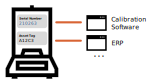
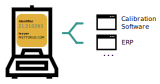
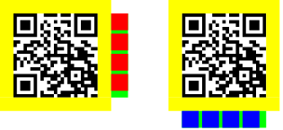
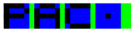
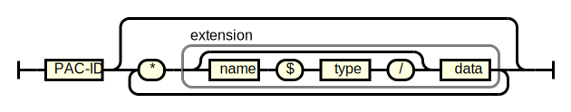

# PAC-ID

## `PAC-ID` in a Nutshell

A `PAC-ID`, which stands for **P**ublicly **A**ddressable **C**ontent **ID**entifier, is a globally unique identifier that operates independently of a central registry. It resembles a URL and serves to reference substances, devices, consumables, or measurement results.

Here is an example `PAC-ID`:
```
HTTPS://PAC.METTORIUS.COM/-MD/240:BAL500/21:210263
```
The `PAC-ID` can also be represented in alternative formats, including as a QR code:


## Introduction

Laboratory software needs to unambiguously refer to real world objects and data. Typically, this is achieved by assigning unique identifiers to objects and data sets. As of today, each software product creates its own proprietary identifiers. With an increasing number of software products deployed in labs, objects usually end up having multiple identifiers. This impacts usability, causes errors and increases maintenance efforts.



_The Balance is known under **multiple** identifiers as each system issues its own._

As part of the Smart Building Blocks for Digital Labs initiative, the **publicly addressable content identifier ("PAC-ID")** addresses this by promoting the re-use of already existing identifiers. The identifier is augmented with information about the issuing system and is represented in standardized formats, thus making it globally unique and reusable across system borders.



_All systems are using the **same** globally unique identifier for referring to the balance._

The `PAC-ID` also serves as foundation for further Smart Building Blocks that provide functionality that wouldn’t be feasible with proprietary identifiers.

## Specification

### Components

A `PAC-ID` is composed of an `issuer` and `identifier` component. It is REQUIRED that the combination of `issuer` and `identifier` is globally unique.

| **Name** | **Meaning** | **Technical Requirements** | **Example** |
| :--- | :--- | :--- | :--- |
| `issuer` | The party which issued the identifier and knows what the identifier refers to. | <ul><li>MUST be a valid domain name according to [RFC 1035](https://www.ietf.org/rfc/rfc1035.html).</li><li>SHOULD be a registered and active domain name.</li><li>SHOULD contain only the following characters `A-Z`, `0-9`, `-`, and `.`</li></ul> | "METTORIUS.COM"<br>(The manufacturer of the balance) |
| `identifier` | The identifier itself. | <ul><li>MUST consist of one or more `id segments` separated by `/`.</li><li>At least one `id segment` MUST be non-empty.</li><li>MUST not exceed 256 characters.</li> <li> See also [Design Considerations for `identifier` and `id segment`](#design-considerations-for-identifier-and-id-segment) </ul>| "-MD/21:210263"<br>(An identifier for one particular balance) |
| `id segment` | The `id segment` is a part of an `identifier` that can stand on its own. Typically used to organize `identifier`s within an `issuer`. | <ul><li>MUST be a valid `hsegment` according to [RFC 1738](https://www.ietf.org/rfc/rfc1738.txt), but without `*` (see [PAC-ID Extension](#pac-id-extension)). </li><li>SHOULD be limited to `A-Z`, `0-9`, and `:-+` for new designs.</li><li>CAN be an `id segment key` and `id segment value` pair separated by `:`.</li></ul> | "21:210263"<br>(An id segment containing a serial number) |
| `id segment key` | The `id segment key` describes the meaning of the `id segment value`. | <ul><li>RECOMMENDED to be a [well-known `id segment key`](well-known-id-segment-keys.md).</li><li>SHOULD be limited to `A-Z`, `0-9`, and `-+`.</li></ul> | "21"<br>(GS1 identifier for Serial Number) |
| `id segment value` | The value corresponding to the `id segment key`. | <ul><li>SHOULD be limited to `A-Z`, `0-9`, and `-+`.</li></ul> | "210263"<br>(A Serial Number) |

### Serialization

#### URL Format

A `PAC-ID` can be represented as a text in the form of a URL as follows:

| **URI Component[^1]** | **Value** |
| :--- | :--- |
| `scheme` | Always `"HTTPS"`. |
| `host` | The `issuer` of the `PAC-ID`, prefixed by `"PAC."`. |
| `path` | The `identifier` of the `PAC-ID`, potentially followed by `*` and arbitrary content. `*` and subsequent characters are not part of the `PAC-ID` and MUST be ignored (extension space, see [PAC-ID Extension](#pac-id-extension)). |

[^1]: according to [RFC 3986](https://www.rfc-editor.org/rfc/rfc3986#appendix-A). All other URI components MUST be empty.

An example `PAC-ID`, represented as URL:
```
HTTPS://PAC.METTORIUS.COM/-MD/240:BAL500/21:210263
```

It is RECOMMENDED that the URL locates a human readable web page which at least discloses information about the `issuer`. The URL MAY also point to a default [`PAC-ID Resolver`](https://github.com/ApiniLabs/PAC-ID-Resolver) that is implemented as a web application on that URL.

### Transmission

`PAC-ID`s MAY be transmitted by any means adequate for the serialization format (URL Format) of `PAC-ID`s (e.g. QR code, NDEF, iBeacon, etc.).

#### Visual Markers

If a `PAC-ID` is represented as QR code or data matrix code, a visual marker MUST be added.


_The example PAC-ID `HTTPS://PAC.METTORIUS.COM/-MD/240:BAL500/21:210263` represented as QR code._

##### Placement of the Visual Marker

-   The visual marker MUST be placed to the right or to the bottom of the 2D-code.
-   The spacing between visual marker and the 2D-code MUST match its minimum quiet zone (yellow area, e.g. 4 modules for QR codes, 1 module for Data Matrix codes)
-   Visual markers placed at the bottom SHALL start from left to right. Right to Left is allowed when surrounded by RTL languages.
-   Visual markers placed at the right, SHALL start from top to bottom.



_Placement of the Visual Marker_

##### Visual Marker Design

- Each visual marker SHALL consist of marker squares (blue), which consist of 5x5 2D-code modules each.
- There MUST be one 2D code module of space (green) between the visual marker squares.
- Each visual marker square MUST have at least one of its 25 2D-code modules set (black).



_Visual Marker Design_

## Recommendations

### Identifier Encodings

If designing new systems based on existing identifiers, consider using Base36 encoded `PAC-ID` `identifier`s for maximizing efficiency when embedded in a QR Code or DataMatrix codes.[^2]

[^2]: When using [Base36](https://en.wikipedia.org/wiki/Base36) encoding, the character set required is limited to `0–9`, `A–Z` (upper-case only), which allows efficient encoding that for example only consumes 5 1⁄2 bits/character in a QR code.

For legacy systems it is recommended to use identifiers as is (with URL-encoding for characters that don’t comply with the character space valid for `id segments`).

### Design Considerations for `identifier` and `id segment`

Using multiple `id segment`s might seem like unnecessary overhead at first. Adding a few additional `id segment`s, however considerably increases the usefulness of `PAC-ID`s. In conjunction with other Smart Building Blocks, especially the `PAC-ID Resolver`. The `PAC-ID Resolver` is able to provide user-handovers/routing to systems that provide information about the corresponding `PAC-ID`. See [PAC-ID Resolver on GitHub](https://github.com/ApiniLabs/pac-id-resolver) for more info.

- Add additional `id segment`s containing information that allows lookup in pre-existing systems (e.g. for a device, its serial number might be the only necessary `id segment` needed for a uniqueness perspective. However, adding the article/product/model number in addition likely allows routing to considerably more content that is relevant for this device)

- Add `id segment`s that partition by resource type or domain. (e.g. a CDS can only provide more information about Chromatography runs, but not MS runs)

- Using the key/value syntax (`id segment key` `:` `id segment value`) with [well-known `id segment keys`](well-known-id-segment-keys.md) enables `PAC-ID` routing in generic contexts.

See also these [recommendations](/recommendation-for-identifier-structure.md) for best practices on structuring the `identifier`.

## PAC-ID Extension
`PAC-ID`s CAN be extended with custom information in one or multiple `extension`s. They MUST be separated from the `PAC-ID` and from each other with a `*`.

### Structure of an `extension`
Railroad diagram depicting the `extension`'s structure: 


| **Name** | **Meaning** | **Technical Requirements** |
| :--- | :--- | :--- | 
| `name` | Name of the extension | SHOULD indicate the purpose and scope of the extension|.
| `type` | Identifies the format of `data` | SHOULD be a [well known extension types](/well-known-extension-types.md).|
| `data` | Attached data | MUST be in the format, specified by `type`. <br> MUST NOT contain the character `/`

It is RECOMMENDED to specify `name` and `type` of the `extension`. If specified, they MUST be followed by a `/`. 

### Recommendation: Summary of What the PAC-ID Is Pointing At
The first extension SHOULD provide a summary of what the `PAC-ID` points to. The `name` of this extension SHOULD be `SUM` and it SHOULD be in the [`T-REX`](https://github.com/ApiniLabs/T-REX) format. 
This extension SHOULD contain the display name in a segment with key `N`.

As an example, a `PAC-ID` pointing to a result set measured by a balance, where the summary contains the measured weight `WEIGHT` and the tare `TARE`:
```
HTTPS://PAC.METTORIUS.COM/-DR/8956757*SUM$TREX/N$T.T:3SQHOW5NBOGUZDM4VWC9N3K99JT3WO0X28DAXDF+WEIGHT$GRM:2.05+TARE$GRM:100.01
```

Another example: a `PAC-ID` pointing to the balance itself, where the summary contains the balance's precision `PREC` and maximum supported weight `MAXWEIGHT`:
```
HTTPS://PAC.METTORIUS.COM/-MD/240:BAL500/21:210263*SUM$TREX/N$T.T:E4BLEW6R5EVD7XMGHG11+PREC$GRM:0.01+MAXWEIGHT$GRM:250
```

#### Short Notation
If `name` and `type` of the first `extension` are omitted, it is assumed to be in `T-REX` format and to summarize the entity the `PAC-ID` refers to. 

Here is the short notation of the first example above:
```
HTTPS://PAC.METTORIUS.COM/-DR/8956757*N$T.T:3SQHOW5NBOGUZDM4VWC9N3K99JT3WO0X28DAXDF+WEIGHT$GRM:2.05+TARE$GRM:100.01
```

The short notation of the second example:
```
HTTPS://PAC.METTORIUS.COM/-MD/240:BAL500/21:210263*N$T.T:E4BLEW6R5EVD7XMGHG11+PREC$GRM:0.01+MAXWEIGHT$GRM:250
```

## Terminology Used

The key words "MUST", "MUST NOT", "REQUIRED", "SHALL", "SHALL NOT", "SHOULD", "SHOULD NOT", "RECOMMENDED", "MAY", and "OPTIONAL" in this document are to be interpreted as described in [RFC 2119](https://www.ietf.org/rfc/rfc2119.txt) "Key words for use in RFCs to Indicate Requirement Levels".

## FAQ

See [here](faq.md).

## License

Shield: [![CC BY-SA 4.0][cc-by-sa-shield]][cc-by-sa]

This work is licensed under a
[Creative Commons Attribution-ShareAlike 4.0 International License][cc-by-sa].

[![CC BY-SA 4.0][cc-by-sa-image]][cc-by-sa]

[cc-by-sa]: http://creativecommons.org/licenses/by-sa/4.0/
[cc-by-sa-image]: https://licensebuttons.net/l/by-sa/4.0/88x31.png
[cc-by-sa-shield]: https://img.shields.io/badge/License-CC%20BY--SA%204.0-lightgrey.svg
