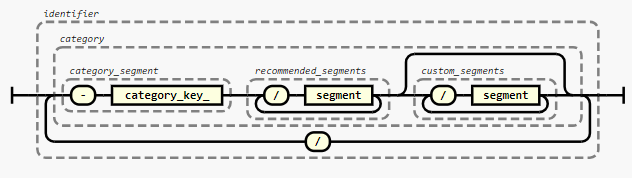
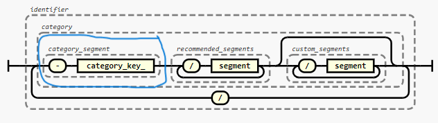
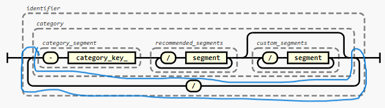

# How to Structure the Identifier of a ``PAC-ID``
The specification of a `PAC-ID` was intentionally kept short. However it is RECOMMENDED to structure the `identifier` of the `PAC-ID` like so:



The following chapters explain the composition in more detail.

## Identify the Category
`PAC-ID`s might be used to identify various different categories of entities. Entities of different categories are treated differently (e.g. a substance can be aliquoted, while a device cannot; a method instructs a device what to do, while a run documents what was done). <br>
In order to account for these differences the first identifier segment MUST [^1] indicate the category.




These categories MUST [^1] by used:
| **Meaning** | **Characteristics**| **category_segment** |
| :--- | :--- | :--- |
| **Materials**||||
| **Device** | uniquely identifiable item, non-aliquotable, not dividable| `-MD` |
| **Substance** <br> Source Material, Aliquot, Sample, Product | uniquely identifiable item, aliquotable/dividable | `-MS` |
| **Consumable** <br> (typically bulk goods with limited lifespan) | uniquely identifiable type of item, typically countable | `-MC` |
| **Misc Material** | anything that doesn’t fit other M types - ideally never used |`-MM` |
**Data**
| **Calibration** <br> Basic Configuration | changeable but valid for all DM/DP/DR | `-DC` |
| **Method** <br> Run Configuration, Receipe, SOP | a definition of a certain process | `-DM` |
| **Progress** <br> Status Update, Live Data | data of time-limited validity occurring while a DM is executed. | `-DP` |
| **Result** <br> Completed Run Data, Report, CoA | data that is a direct result of a completed DM run. | `-DR` | 
| **Static Properties** |  metadata, datasheet, master data, physical properties. Unchangeable, universally true | `-DS` |


## Segment Structure Within a Category 
It is RECOMMENDED to use the following segment structure within a category:


Example of a balance:
```
HTTPS://PAC.METTORIUS.COM/-MD/240:BAL500/21:210263/8008:20230205/8009:ABC
                              |recommended segments|custom segments       |
                           ^ category key
```

### Recommened Segments per Category
Within a category the segments SHOULD follow this structure:
|[Category](#categories) | Segments|
|:---|:---|
**Materials**
Device | **`-MD` <br>`240` (Model number) <br> `21`  (Serial number)** <br>
Substance | **`-MS` <br> `240`  (Product number)** <br> `10`  (Batch number) <br> `20`  (Container size) <br> `21`  (Container number) <br> `250` (Aliquot)
Consumable |**`-MC` <br> `240`  (Product number)** <br> `10` (Batch number) <br> `20` (Packaging size) <br> `21` (Serial number) <br> `250`  (Aliquot)
Misc | **`-MM` <br> `240` (Product number)** <br> `10`  (Batch Number) <br> `20` (Packaging size) <br> `21` (Serial number) <br> `250` (Aliquot)


Segments in bold MUST [^1] be used, the other segments SHOULD be added if they are available. The order SHOULD be preserved, even of optional segments are omitted.


### Custom Segments:
If nessecary custom segements CAN be added. If so, they MUST be placed after the recommended segments.

### Short Notation
In oder to reduce the number of characters a short form MAY be used. 

```
HTTPS://PAC.METTORIUS.COM/-MD/BAL500/210263/8008:20230205
```

The short notation omits the keys for segments of each category. Keys are implicitly assigned based on the [segment order](#Best-practice-for-segment-structure-within-a-category) until an explicit key that differs is reached or an ID segment starting with “-“ is reached.
Explicit keys can be used along implicit ones, as long as the order of segments is matched.

e.g. for ``HTTPS://PAC.METTORIUS.COM/-MD/240:BAL500/210263/8008:20230205``, 210263 is still regarded to have implicit key 21. For ``HTTPS://PAC.METTORIUS.COM/-MD/240:BAL500/8008:20230205/210263`` we can’t auto-assign a key for 12345432 as it is preceded by a segment with an explicit key. 12345432 is therefore interpreted as a custom segment.


## Category Concatenation
Imagine a `PAC-ID` that points to a result set of a device. We’d usually want to know on which device that result was created. We CAN simply concatenate categories (in this case a material category to a data category):



Example:
```
HTTPS://PAC.METTORIUS.COM/-DR/240:123ABC/8008:20230205/-MD/240:BAL500/21:210263
                         | primary category           | additional category
```

The advantage of this is that it allows resolving device related attributes and services (e.g. device operation manual,…) via the same coupling table information entries also used for `PAC-ID`s relating to a device.

The category of the item the `PAC-ID` is referring to, SHALL [^1] be the first category.. 


[^1]: Conditional on the `identifier` being structured according to this recommendation.
