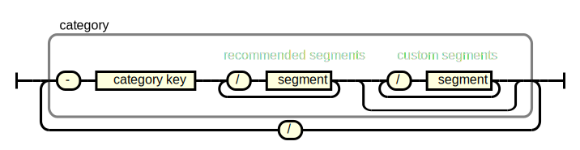

# How to Structure the Identifier of a ``PAC-ID``

While the basic specification for the `PAC-ID` has been intentionally kept minimal, `PAC-ID`s are much more powerful if they are issued both, systematically and with a some verbosity. This page contains recommendations how to structure the `identifier` of the `PAC-ID`. They are designed around these goals goals:

- Verbose enough so that it is always clear
  - to what the `PAC-ID` is pointing to
  - what the uniqueness scope is
- Reliable and easy for service discovery with [PAC-ID Resolver](https://github.com/ApiniLabs/pac-id-resolver)

## Recommended Structure of the `identifier`
To add this verbosity to `PAC-ID`s, it is RECOMMENDED to use the following structure for the `identifier`, which is based on specific `id segments` that identify `cateogries`, that are followed by one or more known `id semgment`s. The `id segment` identifying the start of such a `category`always starts with a `-`. The realroad diagram below illustrates the basic principle.



The following chapters explain the composition in more detail.

## Identify the Category
`PAC-ID`s might be used to identify different categories of entities. Entities of different categories are treated differently (e.g. a substance can be aliquoted, while a device cannot; a method instructs a device what to do, while a run documents what was done).

In order to account for these differences the first `id segment` MUST [^1] indicate the category.

These categories MUST [^1] by used:
| `category key` | Main Category | Subcategory | Meaning |
| :---: | :---: | :---: | :--- |
| `-MD` | **M**(aterial) | **D**(evice) | **Device** <br> _A **Device** is a uniquely identifiable item, non-aliquotable and not dividable._ |
| `-MS` | **M**(aterial) | **S**(ubstance) | **Substance** (Or source material, aliquot, sample, product and the like) <br> _A **Substance** is a uniquely identifiable item, aliquotable and/or dividable._ |
| `-MC` | **M**(aterial) | **C**(onsumable) | **Consumable** <br> _**Consumables** are typically bulk goods with limited lifespan. A **Consumable** is an item with a uniquely identifiable type and typically countable._ 
| `-MM` | **M**(aterial) | **M**(isc) | **Misc** <br> _Anything that doesn’t fit other material (`-M`) types - **ideally never used**._ |
| `-DC` | **D**(ata) | **C**(alibration) | **Calibration** (Or a basic configuration.) <br> _A **Calibration** is changeable data that is used as a basis for running a method (`-DM`) that creates progress data (`-DP`) and / or result data (`-DR`)._ |
| `-DM` | **D**(ata) | **M**(ethod) | **Method** (Or run configuration, receipe, SOP and the like) <br> _A **Method** is a definition of a certain process or workflow._ |
| `-DP` | **D**(ata) | **P**(rogress) | **Progress** (Or status update, live data or the like) <br> _A **Progress** is data of time-limited validity occurring while a method (`-DM`) is executed._ |
| `-DR` | **D**(ata) | **R**(esult) | **Result** (Or completed run data, report, certificate of analysis (CoA) or the like) <br> _A **Result** is data that is a direct result of a completed run of a method (`-DM`)._ |
| `-DS` | **D**(ata) | **S**(tatic) | **Static** (Or metadata, datasheet, master data, physical properties or the like.) <br> _A **Static** is unchangeable and universally true data._ | 

## Segment Structure Within a Category 
It is RECOMMENDED to use the following `identifier` structure within a category:

Example of a balance:
```
HTTPS://PAC.METTORIUS.COM/-MD/240:BAL500/21:210263/8008:20230205/8009:ABC
                             |recommended segments|custom segments       |
                          ^ category key
```

### Recommened `id segment key`s per Category
Within a `category`, the `id segment key`s SHOULD follow this structure:
|[Category](#categories) | `id segment key`s |
|:---|:---|
**Materials**
Device | **`-MD` <br>`240` (Model number) <br> `21`  (Serial number)** <br>
Substance | **`-MS` <br> `240`  (Product number)** <br> `10`  (Batch number) <br> `20`  (Container size) <br> `21`  (Container number) <br> `250` (Aliquot)
Consumable |**`-MC` <br> `240`  (Product number)** <br> `10` (Batch number) <br> `20` (Packaging size) <br> `21` (Serial number) <br> `250`  (Aliquot)
Misc | **`-MM` <br> `240` (Product number)** <br> `10`  (Batch Number) <br> `20` (Packaging size) <br> `21` (Serial number) <br> `250` (Aliquot)

`id segments key`s in **bold** MUST [^1] be used, the other `id segment key`s SHOULD be added if they are available. The order SHOULD be preserved, even if optional `id segment`s are omitted.

### Custom Segments
If needed, custom `id segement`s CAN be added. If so, they MUST be placed after the recommended `id segment`s.

### Short Notation
In oder to reduce the number of characters a short form MAY be used by omitting the `id segment key`s, like this:. 

```
HTTPS://PAC.METTORIUS.COM/-MD/BAL500/210263/8008:20230205
```

The short notation omits the keys for segments of each category. Keys are implicitly assigned based on the [recommended segment order above](#recommened-segments-per-category) until an explicit key that differs is reached or an `id segment` starting with `-` is reached. Explicit keys can be used along implicit ones, as long as the order of segments is matched.

e.g. for ``HTTPS://PAC.METTORIUS.COM/-MD/240:BAL500/210263/8008:20230205``, `210263` is still regarded to have the implicit key `21`. For ``HTTPS://PAC.METTORIUS.COM/-MD/240:BAL500/8008:20230205/210263`` we can’t auto-assign a key for `210263` as it is preceded by a `id segment` with an explicit key. `210263` is therefore interpreted as a normal `id segment` without `id segment key`.

## Category Concatenation
Imagine a `PAC-ID` that points to a result set of a device. We’d usually want to know on which device that result was created. We CAN simply concatenate categories (in this case a material category to a data category):

Example:
```
HTTPS://PAC.METTORIUS.COM/-DR/240:123ABC/8008:20230205/-MD/240:BAL500/21:210263
                         | primary category           | additional category
```

The advantage of this is that it allows resolving device related attributes and services (e.g. device operation manual, …) via the same coupling table information entries also used for `PAC-ID`s relating to a device.

The category of the item the `PAC-ID` is referring to, SHALL [^1] be the first `category`.

[^1]: Altough is not mandatory to follow the recommenation on this page, this rule MUST be applied **if** the identifier is structured according to the recommendations on this page.
