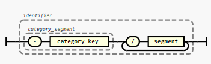
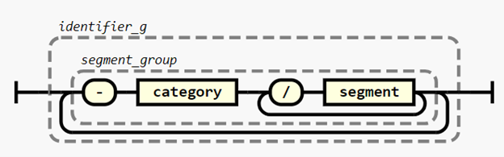

# Recommendations how to structure the identifier 
The specification of a pac ID was intentionally kept short. However it is highly recommended to structure the `identifier` of the PAC-ID according to the following rules:


## Identify the category
PAC-IDs might be used to identify various different categories of entities.

- The first identifier segment SHOULD indicate the category of the entity the PAC-ID identifies 



- These categories SHOULD by used:


| **category_segment** | **Meaning** | **Characteristics**|
| :--- | :--- | :--- |
| **Materials**||||
| `-MD` | **Device** | uniquely identifiable item, non-aliquotable, not dividable|
| `-MS` | **Substance** <br> Source Material, Aliquot, Sample, Product | uniquely identifiable item, aliquotable/dividable | 
| `-MC` | **Consumable** <br> (typically bulk goods with limited lifespan) | uniquely identifiable type of item, typically countable 
| `-MM` | **Misc Material** | anything that doesn’t fit other M types - ideally never used
**Data**
| `-DC` | **Calibration** <br> Basic Configuration | changeable but valid for all DM/DP/DR
| `-DM` | **Method** <br> Run Configuration, Receipe, SOP | a definition of a certain process
| `-DP` | **Progress** <br> Status Update, Live Data | data of time-limited validity occurring while a DM is executed.
| `-DR` | **Result** <br> Completed Run Data, Report, CoA | data that is a direct result of a completed DM run.
| `-DS` | **Static properties** |  metadata, datasheet, master data, physical properties. Unchangeable, universally true


## Best practice for segment structure within a category
It is RECOMMENDED to use the following segment structure within a category:

<!-- |[Category](#categories) | | | | | | |
|:---|:---|:---|:---|:---|:---|:---|
Device | `-MD` | `240` <br> (Model number) * | `21` <br> (Serial number) *|
Substance | `-MS` | `240` <br> (Product number) * | `10` <br> (Batch number) | `20` <br> (Container size) | `21` <br> (Container number) | `250` <br> (Aliquot)
Consumable | `-MC` | `240` <br> (Product number) * | `10` <br> (Batch number) | `20` <br> (Packaging size) | `21` <br> (Serial number) | `250` <br> (Aliquot)
Misc | `-MM` | `240` <br> (Product number) * | `10` <br> (Batch Number) | `20` <br> (Packaging size) | `21` <br> (Serial number) | `250` <br> (Aliquot) -->


|[Category](#categories) | |
|:---|:---|
Device | `-MD` <br>`240`  (Model number) * <br> `21`  (Serial number) *<br>
Substance | `-MS` <br> `240`  (Product number) * <br> `10`  (Batch number) <br> `20`  (Container size) <br> `21`  (Container number) <br> `250` (Aliquot)
Consumable | `-MC` <br> `240`  (Product number) * <br> `10` (Batch number) <br> `20` (Packaging size) <br> `21` (Serial number) <br> `250`  (Aliquot)
Misc | `-MM` <br> `240` (Product number) * <br> `10`  (Batch Number) <br> `20` (Packaging size) <br> `21` (Serial number) <br> `250` (Aliquot)


Example of a balance:
```
HTTPS://PAC.METTORIUS.COM/-MD/240:BAL500/21:123456/8008:20230205
```

Example of a bottle of Ethanol:
```
HTTPS://PAC.OMIKRON.COM/-MS/240:105878/10:A58UZ12/20:1000/21:12345
```


### Short notation
In oder to reduce the number of characters a short form MAY be used. 

```
HTTPS://PAC.METTORIUS/-MD/BAL500/12345432/8088:20230205
```

The short notation omits the keys for segments of each category. Keys are implicitly assigned based on the [segment order](#Best-practice-for-segment-structure-within-a-category) until an explicit key that differs is reached or an ID segment starting with “-“ is reached.
Explicit keys can be used along implicit ones, as long as the order of segments is matched.


e.g. for HTTPS://PAC.NINJA/-MD/240:R300/12345432/II:BUCHI, 12345432 is still regarded to have implicit key 21. For HTTPS://PAC.NINJA/-MD/240:R300/II:BUCHI/12345432 we can’t auto-assign a key for 12345432 as it is preceded by a segment with an explicit key. 12345432 is therefore interpreted as a custom ID segment.


## Segment Groups




Key concepts:
- segment groups
- concetenation thereof

## Category concatenation
Imagine a PAC-ID that points to a result set of a device. We’d usually want to know on which device that result was created. While the PAC-ID as per best practice should start with an ID segment indicating that this is result data followed by that categories' ID segments, we can simply concatenate a material-device category:
```
HTTPS://PAC.METTORIUS.COM/-DR/240:123ABC/-MD/240:BAL2/21:123456*WEIGHT$MGM:256
```

The advantage of this is that it allows resolving device related attributes and services (e.g. device operation manual,…) via the same coupling table information entries also used for PAC-ID’s relating to a device.

It is RECOMMENDED that the category of the item the PAC-ID is referring to, needs to be the first segment. 


